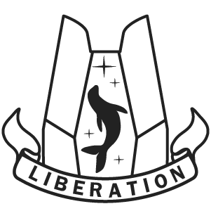

# Selkie Liberation

    
    </img>

    Heavily modified version of 
    <a href="https://github.com/KillahPotatoes/KP-Liberation">KP Liberation</a>
    for the Selkie arma unit.

## Main New Features
#### Higher base difficulty 
- Currently aimed towards ~15 players for a single objective when running ACE3 Medical and [KAT - Advanced Medical](https://steamcommunity.com/workshop/filedetails/?id=2020940806) and [AFL](https://steamcommunity.com/sharedfiles/filedetails/?id=351398948) as infantry with the full suite of medical features enabled
- The goal is to challange players but not straight up kill them
- Its much more fun to struggle get picked back up and continue fighting
- Not tested or balanced for heavy friendy Air or Mechanized gameplay and is not a priority
#### Other
- Reworked enemy patrol system
- Reworked enemy garrison spawns (Enemies now spawn full squads in each building)
- In progress modernization of the codebase to CBA and ACE standards in addition to performance improvements

## Roadmap
- New AI Director based off of Left 4 Dead's with to help solve the difficulty balancing issues with varible play group sizes
- Reworked Battlegroup system to take into account what vehicles will be spawned, no more 10 tank death stacks
- Other future features can be looked at on the issues page

## Required Mods
Future goals to removed some of the direct halo dependencies but that is not currently in scope

- [CBA_A3](https://steamcommunity.com/sharedfiles/filedetails/?id=450814997)
- [ACE3](https://steamcommunity.com/sharedfiles/filedetails/?id=2522638637)
- [LAMBS DangerFSM](https://steamcommunity.com/sharedfiles/filedetails/?id=1858075458)
- [Sci-fi Support Plus](https://steamcommunity.com/sharedfiles/filedetails/?id=2918542818)
- [Zeus Enhanced](https://steamcommunity.com/workshop/filedetails/?id=1779063631)
- [Misriah Armory](https://steamcommunity.com/workshop/filedetails/?id=2901732103)
- [OPTRE](https://steamcommunity.com/workshop/filedetails/?id=769440155)
- [OPTRE FC](https://steamcommunity.com/workshop/filedetails/?id=1572627279)

- [Selkie Platoon Unofficial OPTRE Rebalance](https://steamcommunity.com/workshop/filedetails/?id=3446290834)
- [Selkie Factions: UNSC Armed Forces](https://steamcommunity.com/sharedfiles/filedetails/?id=3561065352)

## Build Instructions

This project uses the [Hemtt](https://hemtt.dev/) build system.

If you are on linux there are vscode configs for Hemett Build and Hemett Release.
Hemett Build (Linux) will copy the misson file to your arma install if it is in your home folder.
It requires [F5 Everything](https://marketplace.visualstudio.com/items?itemName=discretegames.f5anything).
